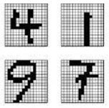

# Pattern Recognition 

**PR** is a field of study focused on identifying patterns and trends within data to make informed decisions.
In this course, students will learn how PR techniques are used in various applications such as image and text recognition. By mastering PR algorithms, students will gain valuable skills in data analysis and decision-making processes.

## Sections of Pattern Recognition
- [Introduction of Pattern Recognition](Introduction/Introduction_1.ipynb#Introduction)
- [Data Visualization](Visualization/Visualization_1.ipynb#Visualization)
- [Clustering](Clustering/Clustering_1.ipynb#Clustering)
- [Regression](Regression/Regression_1.ipynb#Regression)
- [Classification](Classification/Classification_1.ipynb#Classification)

We follow remaining contents in **Machine Learning** include:
Feature Reduction, statistical Regression, ...

