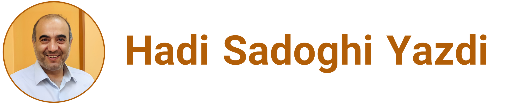

[Hadi Sadoghi Yazdi](https://scholar.google.com/citations?user=Z3XAKb0AAAAJ&hl=en)

# Profile
Welcome to my personal page. Discover the students I mentor, their projects, and the courses I teach. As a Professor at Ferdowsi University of Mashhad, I focus on machine learning, pattern recognition, Signal processing, and image processing.

## Summary
**Academic staff of the university| Research vice president of the university|Director of the pattern recognition laboratory**

for more details: 
[Resume - Hadi Sadoghi Yazdi](SadoghiResume.ipynb)

